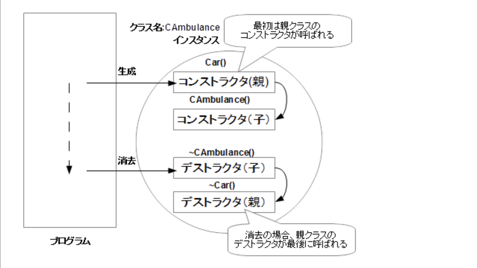

# CPP03で学んだこと
## 親クラスと子クラス
*  基本となるクラスの性質を受け継ぎ、独自の拡張をすることを、オブジェクト指向では、継承という
### claptrap.hppを親クラスとする時
```
class ClapTrap {
protected:
    std::string _name;
    int _hitPoints;
    int _energyPoints;
    int _attackDamage;
public:
    ClapTrap(std::string name);
    ~ClapTrap();
    void attack(const std::string &target);
    void takeDamage(unsigned int amount);
    void beRepaired(unsigned int amount);
};
```
### scavtrap.hppを子クラスとして扱いたい時
```
class ScavTrap : public ClapTrap {
    public:
        ScavTrap(std::string name);
        ~ScavTrap();

        void attack(const std::string &target);
        void guardGate();
};
```
### protected継承は親クラスのpublic及びprotectedなメンバを子クラスでもprotectedとして継承する
### 最初に親クラスが呼ばれて、次に子クラス終了時は子クラスが呼ばれて親クラスが呼ばれる


## 多重継承
* ### 1つのクラスが複数の基底クラスから機能を継承する
## ダイヤモンド継承問題
### クラスが複数の経路で同じ親クラスを継承する場合、どの親クラスのメンバ関数が呼び出されるのか曖昧になる
```
class A {
public:
    void foo() { std::cout << "A::foo()" << std::endl; }
};

class B : public A {};
class C : public A {};

class D : public B, public C {};

int main() {
    D d;
    d.foo(); // どちらのfoo()が呼ばれるのか？
}
```
上のコードはエラー
## 解決策
* 仮想基底クラス：
基底クラスを仮想基底クラスとして宣言することで、重複した基底クラスのインスタンスが1つにまとめられる
* スコープ解決演算子: 
どの基底クラスのメンバ関数を呼び出すのか明示的に指定する 
```
// 仮想基底クラスの例
class A {
public:
    void foo() { std::cout << "A::foo()" << std::endl; }
};

class B : virtual public A {};
class C : virtual public A {};

// スコープ解決演算子の例
d.A::foo(); // 明確にAクラスのfoo()を呼び出す
```
